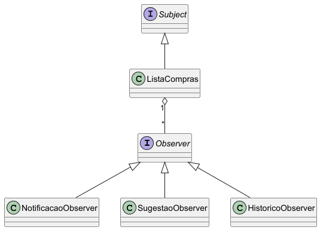

# 🛒 Lista de Compras Inteligente - Padrão Observer

## 📌 Descrição do Projeto

Este projeto implementa uma **Lista de Compras Inteligente** utilizando o padrão de projeto **Observer**.

O sistema permite que diferentes componentes (observers) sejam automaticamente notificados sempre que ocorre uma alteração na lista de compras, como a adição ou remoção de itens. Isso simula um cenário real onde múltiplas funcionalidades reagem a eventos de forma desacoplada.

O padrão **Observer** foi utilizado para garantir baixo acoplamento entre a lista de compras (Subject) e os componentes que reagem às mudanças (Observers), permitindo maior flexibilidade e facilidade de manutenção.

### 🔎 Funcionalidades implementadas:

* Notificação ao adicionar itens
* Sugestões automáticas de produtos relacionados
* Registro de histórico de ações
* Suporte a múltiplos observers simultaneamente

### 📊 Diagrama de Classes



---

## 🏗️ Estrutura do Projeto

```plaintext
src/main/
 ├── Main.java
 ├── model/
 ├── observer/
 ├── observers/
 └── subject/
```

---

## ▶️ Como Executar

1. Abrir o projeto no IntelliJ
2. Executar a classe `Main.java`
3. Observar a saída no console

---

## 🧪 Testes

Os testes foram implementados utilizando **JUnit**, cobrindo:

* Notificação de observers
* Múltiplos observers
* Remoção de observers
* Casos de borda

Para rodar os testes:

* Clique com botão direito na classe de teste → **Run**

---

## 📚 Tecnologias Utilizadas

* Java
* IntelliJ IDEA
* JUnit
* PlantUML
